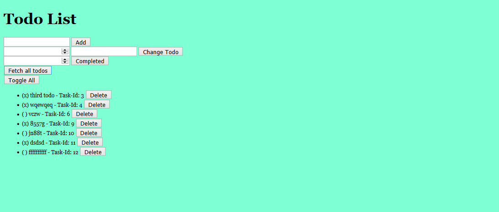

# Restful-pjs

## Table of contents

- [General info](#general-info)
- [Technologies](#technologies)
- [Setup](#setup)
- [Screen Capture of Project](#screen-capture-of-project)
- [Project Status](#project-status)
- [Contact](#contact)

## General info

A dynamic web page for an application built with ...fullstack design ! this project designed based on my previously finished code from Practical JavaScript in my repo (you can check it out ). The RESTful backend is provided, and I have desinged the frontend app. 
Studying this project I have learned and done the follwoing :

- Use ES6 classes
- Use fetch
- Store it's data in db.json
- Be in the /public folder
- Build from /public/index.html
- Be built in steps with branches, issues, and a project board

## Technologies

This project is created with:

- ECMAScript6 
- HTML5 /CSS3
- db.json

## Setup

Clone this repository and start using it with your editor.

## Screen Capture of Project

Try the live demo [right here](https://rashaali84.github.io/restful-pjs/), it looks something like this:

## Project Status

Project is finished .

## Contact
  
Here is a link for my repository [my repository](https://rashaali84.github.io/)
# To-do list Project- restfulpjs:

